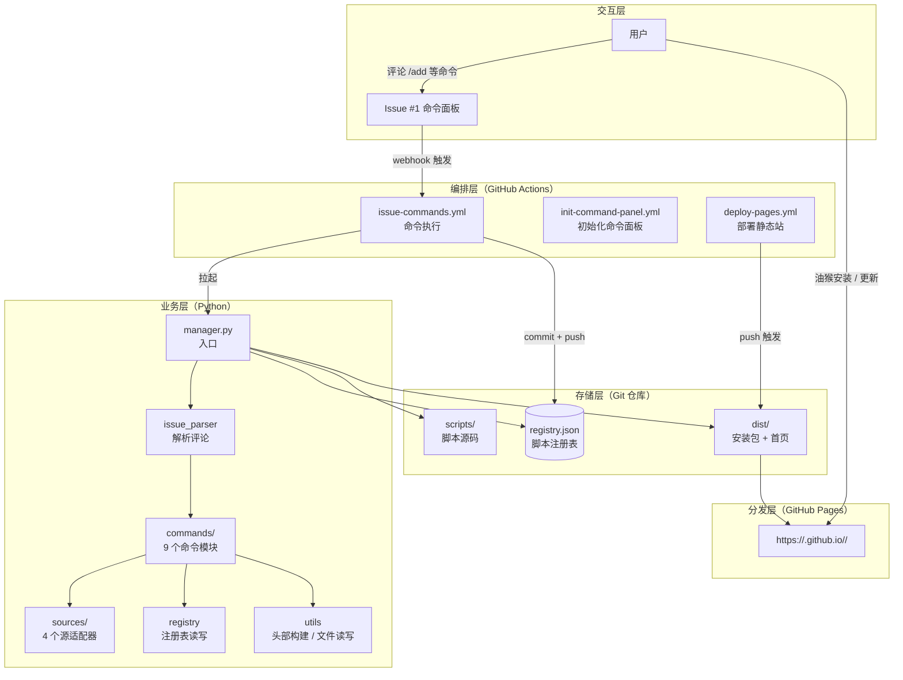
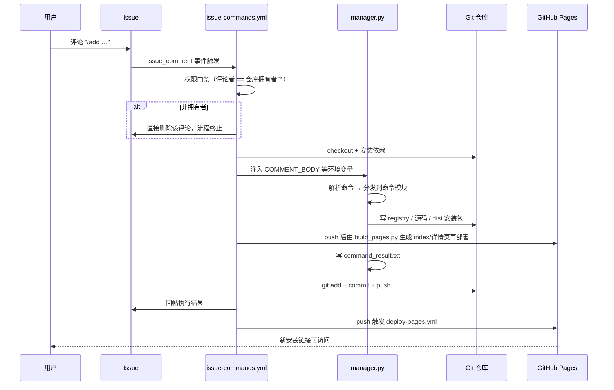

# 油猴脚本管理系统设计文档

## 1. 项目概述

### 1.1 这是什么

这是一个**零服务器的油猴（Tampermonkey）脚本管理与分发系统**。它把 GitHub 免费提供的基础设施拼成一个完整的脚本管理后台：

- **Issues** 充当控制台——你在评论区敲命令
- **GitHub Actions** 充当服务端——执行命令、构建产物
- **Git 仓库** 充当数据库——所有状态以文件形式入库
- **GitHub Pages** 充当 CDN——分发 `.user.js` 安装包

整个系统没有一台常驻服务器，没有数据库进程，没有自建鉴权。

### 1.2 解决什么问题

| 痛点 | 本项目的做法 |
|------|-------------|
| 油猴脚本散落在浏览器里，换设备就丢 | 脚本统一存入 Git 仓库，版本化、可回滚 |
| 自建脚本管理站要服务器 + 域名 + 鉴权 | 全部复用 GitHub 免费能力，Fork 即用 |
| 手机上不好管理脚本 | Issue 评论就是命令行，GitHub App 体验手机友好 |
| 自写脚本和第三方同步脚本混在一起 | 两类脚本分目录存储，同步脚本记录来源 URL，可一键拉取上游更新 |
| 安装链接不稳定（raw 地址国内常被阻断） | 分发走 Pages/CDN，`@downloadURL`/`@updateURL` 指向同一链接，油猴可自动检查更新 |

### 1.3 典型使用场景

1. 你在 Issue #1 里贴一段自写脚本，回车——系统生成安装链接
2. 你贴一个 GreasyFork 链接——系统抓取第三方脚本，替换成自己的分发地址入库
3. 上游脚本更新了——评论 `/sync <id>` 拉取新版，版本号自动更新，油猴用户收到更新推送

## 2. 设计目标与非目标

### 2.1 设计目标

- **零运维**：不引入任何常驻进程，跑完即销毁（Actions runner 特性）
- **状态持久**：Actions 每次运行都是全新环境，所有状态必须提交进 Git（这是本项目最重要的架构约束，见 6.1）
- **手机可用**：核心操作路径在 GitHub 移动端 App 内闭环
- **私有仓库可用（管理功能）**：命令与状态存储不依赖公开服务；注意免费账户下 GitHub Pages 分发需 Public 仓库
- **全量留痕**：每次操作对应一次 commit，天然具备审计日志和回滚能力
- **可插拔**：新命令、新同步源都是加一个文件的事

### 2.2 非目标

- **不追求实时性**：一条命令从发出到生效有分钟级延迟（Actions 排队 + 执行）
- **不做多用户协作**：权限模型只认仓库拥有者（见第 9 章）
- **不做脚本市场**：不提供脚本发现、搜索、评分等社区功能
- **不保证并发**：短时间连续发命令可能因 Git push 竞争而失败（见第 12 章）

## 3. 总体架构



四个层次的职责边界：

| 层 | 承担者 | 职责 | 不做什么 |
|----|--------|------|---------|
| 交互层 | Issue #1 | 收集用户意图 | 不做任何校验和处理 |
| 编排层 | GitHub Actions | 权限门禁、环境准备、结果回写、状态提交 | 不含业务逻辑 |
| 业务层 | Python（`userscript_manager/`） | 命令解析、元数据提取、文件生成 | 不感知 GitHub API |
| 存储层 | Git 仓库 | 持久化全部状态 | — |
| 分发层 | GitHub Pages | 对外提供安装/更新地址 | 不做鉴权 |

**关键分层原则**：Python 代码完全不调用 GitHub API（读评论、回评论、删评论全部由工作流的 bash 步骤用 `gh` 完成），因此业务层可以在本地完整跑通和测试。

## 4. 数据模型

### 4.1 注册表 `registry.json`

所有脚本的唯一权威数据源，JSON 结构：

```json
{
  "scripts": [
    {
      "id": "d1620a7a-ae3b-4817-ae2b-016f48cf81a1",
      "type": "self",
      "name": "我的去广告脚本",
      "version": "1.0.0",
      "description": "",
      "author": "Your Name",
      "namespace": "https://your-namespace.com",
      "match": ["*://*/*"],
      "grant": ["none"],
      "enabled": true,
      "created_at": "2026-08-20T14:18:57.696055Z",
      "updated_at": "2026-08-20T14:18:57.696068Z",
      "source_url": null,
      "source_type": null,
      "last_synced_at": null,
      "sync_enabled": false,
      "documentation": "# 文档……",
      "changelog": [
        {"version": "1.0.0", "date": "2026-08-20", "note": "初始版本"}
      ]
    }
  ]
}
```

字段分组说明：

| 分组 | 字段 | 说明 |
|------|------|------|
| 标识 | `id`、`type` | 自写脚本用 UUID；同步脚本用来源 URL 的 MD5 前 12 位（同一 URL 天然去重） |
| 元数据 | `name`、`version`、`match`、`grant` 等 | 从 `==UserScript==` 头部提取 |
| 状态 | `enabled`、`sync_enabled` | 启用标记与自动同步开关 |
| 同步 | `source_url`、`source_type`、`last_synced_at` | 仅同步脚本有值 |
| 文档 | `documentation` | Markdown 文档正文（README 由 `save_documentation` 按约定路径写入，不留冗余路径字段） |
| 变更 | `changelog` | 版本行数组，新行在前 |

### 4.2 两类脚本对比

| 维度 | 自写脚本（`self`） | 同步脚本（`synced`） |
|------|-------------------|---------------------|
| ID | UUID v4 | `md5(source_url)[:12]` |
| 源码目录 | `scripts/self/<id>/index.js` | `scripts/synced/<id>/script.user.js` |
| 修改方式 | `/add`、`/up` 全量替换 | 仅从上游拉取，本地不直接改 |
| dist 构建 | 重建头部（注入安装地址） | 保留原样，只替换 `@downloadURL`/`@updateURL` |
| 版本变化 | `/up` 时 patch 自动 +1 | 跟随上游版本 |
| 文档 | 支持 Markdown，存 README.md | 无本地文档 |

## 5. 命令处理流程

一条命令从发出到生效的完整时序：



两条触发链的时序约定：

- **命令链**（`issue_comment`）：执行 → 提交 → 回帖，同步完成
- **部署链**（`push`）：任何提交都会触发 Pages 部署，与命令链解耦

### 5.1 评论解析规则

`issue_parser.py` 的解析约定：

- 取**第一行**匹配 `/<command> [args]` 的作为命令，命令名统一转小写
- 第一行之后的全部内容作为 `markdown`（脚本文档）
- 用正则提取第一个 ``` 围栏代码块作为 `code`（脚本代码）
- 三个字段独立传递：`args` 给定位参数、`code` 给脚本内容、`markdown` 给文档

命令函数签名统一为：

```python
def execute(registry, args, code, markdown, has_code_block) -> str
```

返回值即回帖内容，由工作流写入 Issue 评论。

## 6. 关键设计决策

### 6.1 状态必须入库（最重要的一条）

Actions runner 是**一次性**的：每次运行结束后整个工作区销毁。最初的设计把 `registry.json` 和 `dist/` 放进 `.gitignore`，导致每次执行都是"空数据库冷启动"——命令看似成功，实际状态从未保存。

由此确立的规则：**凡是需要跨次运行保留的东西，一律提交进 Git**。当前入库的状态包括：

- `registry.json` —— 注册表
- `scripts/` —— 脚本源码与文档
- `dist/` —— 安装包与首页
- 唯一例外：`command_result.txt`（同一次运行内传递回帖内容，运行结束即失效，保持 gitignore）

### 6.2 用户输入走环境变量，不走内联插值

工作流中评论内容、用户名等用户可控数据全部通过 `env:` 传入：

```yaml
env:
  COMMENT_BODY: ${{ github.event.comment.body }}
run: python manager.py
```

而不是拼进 `run:` 的 shell 字符串。这样评论里写什么都不会被 shell 执行，消除注入面。

### 6.3 两类脚本的 dist 构建策略不同

- **自写脚本**：头部按注册表元数据重建，注入 `@downloadURL`/`@updateURL`
- **同步脚本**：上游代码保持逐字不动，只做 URL 替换。这样 `sync_script` 可以用"源码文本比对"判断上游是否有更新——一旦改动头部，比对就会永远失败

### 6.4 安装链接统一走 Pages

`config.get_install_url()` 是安装地址的唯一生成点，格式：

```
https://<owner>.github.io/<repo>/dist/<id>.user.js
```

脚本头部的 `@downloadURL` 和 `@updateURL` 指向同一地址，油猴据此自动检测更新。可通过仓库变量 `GITHUB_PAGES_URL` 覆盖（自定义域名场景）。

### 6.5 硬编码 Issue #1 为命令面板

`config.py` 中 `control_issue_number = 1`。初始化工作流保证面板 Issue 恒为 #1（不存在才创建）。`manager.py` 和工作流两处校验 Issue 编号，其余 Issue 的评论完全不触发任何操作。

## 7. 模块划分

```
manager.py                          # 入口：读环境变量、加载注册表、分发命令、回写结果
userscript_manager/
├── config.py                       # 配置中心 + 安装 URL 生成
├── registry.py                     # 注册表读写、增删改查
├── issue_parser.py                 # 评论 → ParsedComment（命令/参数/文档/代码）
├── utils.py                        # 头部构建、元数据提取、文件读写、版本自增、首页生成
├── commands/                       # 命令模块，@register 注册到命令表
│   ├── list / add / remove / update / sync
│   ├── info / toggle / export
└── sources/                        # 源适配器，实现 BaseSourceAdapter
    ├── base.py                     # 适配器抽象 + 注册/查找
    ├── greasyfork.py
    ├── userscript_zone.py
    ├── github_gist.py
    └── direct_url.py
```

两个扩展点都采用**注册表模式**：

| 扩展类型 | 步骤 | 机制 |
|---------|------|------|
| 新命令 | `commands/` 下加文件，函数加 `@register("name")` | `manager.py` 用 `pkgutil` 自动发现导入 |
| 新同步源 | `sources/` 下加类，`sources/__init__.py` 中 `register_adapter()` | 按域名匹配分发到适配器 |

## 8. 工作流设计

| 工作流 | 触发条件 | 职责 | 关键点 |
|--------|---------|------|--------|
| `issue-commands.yml` | Issue #1 的新评论 | 权限门禁 → 执行命令 → 提交状态 → 回帖 | 非授权评论自动删除；回帖用 `$'\n'` 保证换行 |
| `init-command-panel.yml` | push 到 master / 手动 | 确保 Issue #1 命令面板存在 | 先查后建，重复触发幂等；heredoc + `--body-file` 写正文 |
| `deploy-pages.yml` | push 到 master / 手动 | 上传 `dist/` 为 Pages 产物并部署 | `concurrency` 组防止部署交错 |

分支约定：三个工作流均监听 `master` 分支。

## 9. 权限与安全模型

```
评论到达
  │
  ├─ Issue 编号 ≠ 1 ──────────→ 忽略
  ├─ 评论者 ≠ 仓库拥有者 ────→ 删除评论
  └─ 评论者 = 仓库拥有者 ────→ 执行命令
```

- **两道校验**：工作流 `if` 限制 Issue 编号；权限门禁步骤比较 `COMMENT_USER == REPO_OWNER`；`manager.py` 内部再校验一次（纵深防御）
- **失败即删除**：非拥有者的命令评论由机器人调 `gh api DELETE` 删除，避免命令面板被噪音淹没
- **Token 最小化**：各工作流只声明自己需要的 `permissions`（命令链 `contents: write` + `issues: write`，部署链 `pages: write` + `id-token: write`）
- **已知边界**：权限模型只认仓库拥有者本人，Collaborator 的评论会被删除（是否放开见第 12 章）

## 10. 文件布局与生命周期

一条 `/add` 命令产生的文件变化：

```
registry.json                                    # 新增 scripts[] 条目
scripts/self/<uuid>/index.js                     # 脚本源码
scripts/self/<uuid>/README.md                    # Markdown 文档（如有）
dist/<uuid>.user.js                              # 安装包（头部注入安装地址）
dist/index.html                                  # build_pages.py 部署时生成（gitignore，不入库）
command_result.txt                               # 回帖内容（gitignore，不入库）
```

一次 `/rm` 命令则反向清理：注册表删条目、删除源码目录、删除 dist 安装包。

## 11. 环境变量与配置

| 变量 | 来源 | 用途 |
|------|------|------|
| `COMMENT_BODY` | 工作流注入 | 评论原文 |
| `COMMENT_USER` / `REPO_OWNER` | 工作流注入 | 权限比较 |
| `ISSUE_NUMBER` | 工作流注入 | 命令面板校验 |
| `GITHUB_REPOSITORY` | GitHub 自动注入 | 推导仓库地址 |
| `GITHUB_PAGES_URL` | 仓库变量（可选） | 覆盖 Pages 基础地址（自定义域名） |
| `AUTHOR_NAME` / `AUTHOR_NAMESPACE` | 仓库变量（可选） | 脚本默认作者信息 |

本地开发不受影响：所有配置都有默认值，`python manager.py` 可直接在本地带环境变量运行调试。

## 12. 已知限制

| 限制 | 影响 | 现状 |
|------|------|------|
| 分钟级延迟 | 命令不是即时生效 | 架构取舍，可接受 |
| 无并发保护 | 短时间连发命令可能 push 冲突，后者静默失败 | 已修复：issue-commands.yml 加 concurrency 组 |
| 单用户权限 | Collaborator 无法使用 | 权限模型设计如此，待定 |
| 同步脚本只读 | 不能本地改同步脚本 | 设计如此，保证上游比对可靠 |
| `sync_enabled` 无消费者 | 自动同步开关目前没有定时任务消费 | 计划补 cron 工作流或删除字段 |
| 自写脚本头部重建 | `@require` 等未提取字段在 dist 中丢失 | 已修复：build_userscript_header 改为保留原头部，只注入安装地址与版本 |

## 13. 三门面架构（真源 + 投影）

系统对外有三个门面，全部由 Git 仓库这一真源单向投影而来（完整设计见 `docs/superpowers/specs/2026-10-01-three-facades-design.md`）：

| 门面 | 承载设施 | 投影方式 |
|------|---------|---------|
| B. 仓库 + 控制台 | Issue #1 + README | issue_comment 触发，权限门禁，回帖 |
| C. 脚本独立页 | Issues | `project_issues.py` 经 GraphQL 幂等对账：创建 / 更新 / 回填 / 墓碑化 |
| A. 列表站 | GitHub Pages | `build_pages.py` 部署时生成，HTML 不入库 |

核心约定：

- **状态必须入库**：`registry.json` 的 `issue` 追踪字段（number/node_id/url）与 `changelog` 更新历史
- **机器人只碰 Issue 正文**（首行 `<!-- script-id -->` 标记用于孤儿对账），评论区永远留给人
- **`/rm` 墓碑化**：标题加「[已删除]」前缀、正文替换、移除标记，保留人类讨论
- **投影失败不阻断命令**：警告写入回帖，下次执行时自动重试对账
